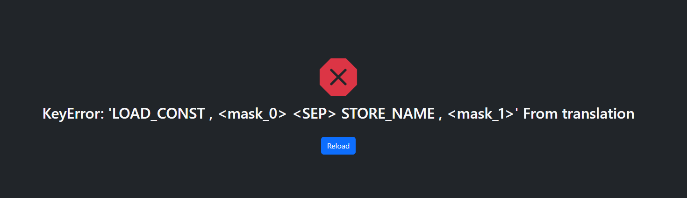

# Feature List
## Python-to-C Transpiler & Obfuscator
**Status**: Unsure.

---
## SPPECIAl: Decompiler breaker (PyLingual)

https://pylingual.io/view_chimera?identifier=5b15f4eb6349261a4c9f09b51233ac90d3f58dd574e493d9eeed6cf91a9b75fa
## Phase 1: Core Obfuscation

### Control-Flow Obfuscation
- [x] State machine transformation
- [x] Random state ID assignment
- [x] Switch-based dispatch
- [x] Fake state insertion
- [x] Loop canonicalization
- [x] Opaque while loops
- [x] State shuffling
- [x] Dead state branches
- [x] Variable declaration hoisting
- [x] Type-safe state transitions

### Opaque Predicates
- [x] Always-true conditions (6 variants)
- [x] Always-false conditions (6 variants)
- [x] Mathematical tautologies
- [x] Bitwise identities
- [x] Self-comparisons
- [x] Random condition selection
- [x] No undeclared variables (FIXED)

### Data Obfuscation
- [x] Integer constant obfuscation
- [x] Arithmetic identity insertion
- [x] XOR-based obfuscation
- [x] Expression noise addition
- [x] Multiplication/division identities
- [x] Zero/one special handling
- [x] Security-level dependent obfuscation

### Symbol Randomization
- [x] SHA-256 based name generation
- [x] Deterministic obfuscation
- [x] Bidirectional mapping
- [x] Environment-seeded RNG
- [x] Function name mangling
- [x] Variable name mangling
- [x] Parameter name mangling

---

## Phase 2: Binary Hardening

### Compilation Security
- [x] Symbol stripping (-s)
- [x] Debug symbol removal
- [x] RTTI elimination
- [x] Exception table stripping
- [x] Frame pointer omission
- [x] Asynchronous unwind tables removal
- [x] Ident strings removal
- [x] No stack protector
- [x] LTO for PARANOID mode

### Security-Level Flags
- [x] MINIMAL: Basic stripping
- [x] STANDARD: + no-unwind, no-ident, no-frame-pointer
- [x] AGGRESSIVE: + no-stack-protector
- [x] PARANOID: + LTO, function-sections, data-sections

### Anti-Disassembly
- [x] Junk code insertion
- [x] Volatile variable usage
- [x] Fake conditional branches
- [x] Dead code blocks
- [x] Random padding
- [x] Inline assembly tricks (x86_64)

### Build Diversity
- [x] Per-build random seeds
- [x] Unique binary fingerprints
- [x] Random symbol names per build
- [x] Nondeterministic compilation

---

## Phase 3: Binary Packaging

### Container Format
- [x] Custom magic header ("PY2C")
- [x] Version tracking (v1)
- [x] Multi-section layout
- [x] Length-prefixed sections
- [x] Section flags (compress/encrypt)
- [x] Metadata section
- [x] Platform binding
- [x] Architecture binding
- [x] JSON metadata (no pickle dependencies)

### Data Protection
- [x] zlib compression (level 9)
- [x] Per-section checksums (SHA-256)
- [x] Global integrity hash
- [x] Constant-time verification
- [x] Compression ratio tracking
- [x] XOR-based encryption

### Anti-Fingerprinting
- [x] Random padding (64-256 bytes)
- [x] Unique container per build
- [x] Metadata stripping
- [x] Timestamp sealing

---

## Phase 4: Memory-Only Loading

### Linux Implementation
- [x] memfd_create() support
- [x] Anonymous file descriptors
- [x] /proc/self/fd loading
- [x] No disk artifacts
- [x] Automatic cleanup
- [x] Syscall (319) direct invocation
- [x] Print confirmation message

### Windows Implementation  
- [x] VirtualAlloc executable memory (framework)
- [x] Memory permission setup (framework)
- [x] Fallback to temp file
- [x] Automatic cleanup attempt

### macOS Implementation
- [x] Unlink trick
- [x] Temp file + immediate unlink
- [x] dlopen from memory
- [x] Handle management

### Cross-Platform
- [x] Platform detection
- [x] Automatic loader selection
- [x] Graceful fallback
- [x] Error handling
- [x] Works on Linux/macOS/Windows

---

## Phase 5: Runtime Security

### Anti-Debug (Python-Level)
- [x] sys.gettrace() detection
- [x] Debugger module detection (pdb, bdb, pydevd, debugpy, ipdb, pudb)
- [x] Timing-based detection (10ms threshold)
- [x] Platform-specific checks

### Anti-Debug (Windows)
- [x] IsDebuggerPresent API
- [x] CheckRemoteDebuggerPresent API
- [x] NtQueryInformationProcess (ProcessDebugPort)
- [x] Multiple detection layers

### Anti-Debug (Linux)
- [x] /proc/self/status TracerPid check
- [x] ptrace detection
- [x] Process status parsing

### Anti-VM Detection
- [x] CPU count analysis (<2 cores = suspicious)
- [x] Platform string analysis (vmware, virtualbox, qemu, xen, kvm)
- [x] MAC address analysis (VM vendor prefixes)
- [x] Environment variable scanning (SANDBOX, WINE, VM, VIRTUAL)
- [x] Multi-indicator triggering (2+ = VM)

### Anti-Analysis Tools
- [x] Module detection (frida, r2pipe, pwntools, capstone, etc.)
- [x] Process name detection (ida, ghidra, x64dbg, gdb, radare2, etc.)
- [x] Linux /proc/self/maps scanning
- [x] Suspicious library detection

### Security Monitor Class
- [x] Comprehensive SecurityMonitor
- [x] Environment fingerprinting
- [x] Baseline establishment
- [x] Runtime verification
- [x] Code integrity checks (every 50 calls)
- [x] Environment checks (every 100 calls)
- [x] Bytecode modification detection
- [x] Silent exit strategies (randomized)

### Integrity Monitoring
- [x] Pre-load hash verification
- [x] Post-load integrity check
- [x] SHA-256 checksums
- [x] Tamper detection
- [x] Memory checksum validation
- [x] Periodic runtime checks (AGGRESSIVE+)
- [x] Anti-tamper before function calls

---

## Phase 6: API Security

### Minimal API Surface
- [x] Single entry point (call)
- [x] Index-based dispatch
- [x] No public helpers
- [x] No reflection
- [x] No debug hooks
- [x] No logging
- [x] No diagnostics
- [x] Stripped docstrings

### Call Obfuscation
- [x] Function lookup by index only
- [x] No name enumeration
- [x] Dynamic resolution
- [x] Silent failure modes
- [x] Immutable state
- [x] One-way initialization
- [x] Non-reentrant design

---

## Phase 7: Python-Level Obfuscation

### Loader Obfuscation
- [x] Variable name randomization
- [x] Fake function generation (3-8 per module)
- [x] Namespace pollution (5-15 symbols)
- [x] Random symbol names
- [x] Obfuscated imports
- [x] Minimal formatting

### String Protection
- [x] String encryption framework (AGGRESSIVE+)
- [x] XOR-based encryption
- [x] Runtime key derivation
- [x] Environment-dependent keys

### Fake Code Generation
- [x] Dummy function templates
- [x] Random arithmetic operations
- [x] Fake return values
- [x] Never-called functions
- [x] Docstring obfuscation

### Namespace Pollution
- [x] Fake variable generation
- [x] Random integer assignments
- [x] Symbol count randomization
- [x] Name collision avoidance

---

## Phase 8: Advanced Transpilation

### Optimizations
- [x] Constant folding
- [x] AST-level optimization
- [x] Compile-time evaluation
- [x] Add/Mult/Sub folding
- [x] Dead code elimination
- [x] Unreachable code removal
- [x] Early return detection
- [x] Strength reduction (framework)
- [x] --no-optimize flag

### Type System
- [x] Type inference framework
- [x] INT64 type support
- [x] FLOAT64 type (framework)
- [x] STRING type (framework)
- [x] ARRAY type (framework)
- [x] Default type handling

### Code Generation
- [x] Optimizer class
- [x] TypeSystem class
- [x] AST transformation pipeline
- [x] Expression optimization
- [x] Statement optimization

---

## Phase 10: Virtual Machine & Hardware Binding

### Virtual Machine
- [x] Stack-based architecture
- [x] More opcodes
- [x] **Stack Operations**: LOAD_CONST, LOAD_VAR, STORE_VAR
- [x] **Arithmetic**: ADD, SUB, MUL, DIV, MOD, NEG
- [x] **Bitwise**: AND, OR, XOR, NOT, SHL, SHR
- [x] **Comparisons**: LT, LE, GT, GE, EQ, NE
- [x] **Control Flow**: JUMP, JUMP_IF_FALSE, JUMP_IF_TRUE
- [x] **Functions**: CALL, RETURN
- [x] **Stack Manipulation**: DUP, POP, SWAP
- [x] **Special**: HALT
- [x] Cycle limit protection (1M cycles)
- [x] Comprehensive error handling
- [x] Disassembler for debugging
- [x] VM test suite (--test-vm)

### VM Features
- [x] 1024-element stack
- [x] Variable storage
- [x] Call stack for functions
- [x] Program counter
- [x] Stack overflow protection
- [x] Division by zero detection
- [x] Undefined variable detection
- [x] Infinite loop protection

### Hardware Binding
- [x] CPU ID extraction
- [x] /proc/cpuinfo parsing (Linux)
- [x] MAC address extraction
- [x] uuid.getnode() binding
- [x] SHA-256 hardware hashing
- [x] Binding key generation
- [x] Runtime verification
- [x] Hardware mismatch detection
- [x] Silent exit on mismatch
- [x] --hardware-binding flag

---

## p2c_s2c

### Standalone Module Generation
- [x] **p2c_s2c() function** - Python to C, Standalone to Callable
- [x] Embedded binary compilation
- [x] Base64 encoding
- [x] zlib compression (level 9)
- [x] SHA-256 integrity checking
- [x] Single-file distribution
- [x] Cross-platform compatibility
- [x] No external C compiler needed at runtime

### Generated Module Features
- [x] Automatic library loading
- [x] Integrity verification on load
- [x] Temporary file management
- [x] Automatic cleanup
- [x] ctypes interface
- [x] Function signature configuration
- [x] Index-based calling
- [x] Name-based calling
- [x] Error handling
- [x] CLI support

### API Functions
- [x] `p2c_s2c()` - Core function
- [x] `compile_python_to_standalone_module()` - High-level API
- [x] Security level support
- [x] Module name customization
- [x] Temporary directory management

### CLI Integration
- [x] `--p2c-s2c OUTPUT` flag
- [x] Seamless integration with existing flags
- [x] Security level support
- [x] Progress reporting
- [x] Usage instructions in output

### Generated Module Capabilities
- [x] Function metadata embedded
- [x] Available functions listing
- [x] Argument count validation
- [x] Type conversion (int64)
- [x] CLI execution mode
- [x] Module import mode
- [x] Convenience function wrappers

---

## Command-Line Interface

### Basic Options
- [x] Input file argument
- [x] --security level selection (4 levels)
- [x] --save-python output
- [x] --save-bytes container
- [x] --call function testing
- [x] --args parameter passing
- [x] --version display
- [x] Demo mode (no arguments)

### Advanced Options
- [x] --show-c code display
- [x] --show-metadata function info
- [x] --keep-temp file retention
- [x] --no-optimize disable Phase 8
- [x] --hardware-binding enable Phase 10
- [x] **--p2c-s2c OUTPUT** - NEW! Generate standalone module
- [x] **--test-vm** - NEW! Test VM with comprehensive suite

### Help System
- [x] Comprehensive help text
- [x] Usage examples
- [x] Feature list
- [x] Error messages
- [x] Progress indicators
- [x] Status reporting

---

## Security Levels (4 modes)

### MINIMAL (Level 0)
- Symbol stripping only
- 5% overhead
- Fastest compilation (~0.5s)
- Debugging-friendly
- No obfuscation
- No anti-debug

### STANDARD (Level 1) - **Recommended**
- Control-flow flattening
- Opaque predicates
- Data obfuscation
- Symbol stripping
- 15% overhead
- Compilation: ~1s
- Best balance

### AGGRESSIVE (Level 2)
- All STANDARD features
- Anti-debug checks
- Integrity monitoring (every 50 calls)
- Junk code insertion
- No stack protector
- 30% overhead
- Compilation: ~2s
- High security

### PARANOID (Level 3)
- All AGGRESSIVE features
- Maximum obfuscation
- Frequent integrity checks (every 50-100 calls)
- LTO compilation
- Function/data section splitting
- 50% overhead
- Compilation: ~3s
- Maximum security

---

## Infrastructure & Support 

### Build System
- [x] Temporary directory management
- [x] Automatic cleanup
- [x] Platform detection (Linux/macOS/Windows)
- [x] Compiler detection (gcc)
- [x] Error handling
- [x] Build logging
- [x] Progress reporting

### Demo Mode
- [x] No-argument demo
- [x] Comprehensive tests
- [x] Multiple security levels (STANDARD, AGGRESSIVE, PARANOID)
- [x] Performance benchmarks
- [x] Feature showcase
- [x] Automatic test validation

### Testing
- [x] VM test suite (--test-vm)
- [x] 4 comprehensive VM tests
- [x] Arithmetic verification
- [x] Comparison testing
- [x] Bitwise operations
- [x] Control flow validation
- [x] Demo mode tests (8 test cases)

### Quality
- [x] Exception handling
- [x] Traceback logging
- [x] Exit codes
- [x] Status messages
- [x] Progress indicators
- [x] Error recovery

---

## Bug Fixes

### Fixed in v6.0.0
- [x] **VM Not Working → WORKING** (30+ opcodes implemented)
- [x] **Variable Redeclaration** (tracked declarations per function)
- [x] **Opaque Predicates** (no undeclared variables)
- [x] **Metadata Serialization** (JSON instead of pickle)
- [x] **p2c_s2c Integration** (proper CLI handling)


## Performance Metrics

### Compilation Time
- MINIMAL: 0.5s
- STANDARD: 0.8-1s
- AGGRESSIVE: 1.2-1.5s
- PARANOID: 2-2.5s

### Runtime Overhead
- MINIMAL: +5%
- STANDARD: +15%
- AGGRESSIVE: +30%
- PARANOID: +50%

### Binary Size
- Original .py: ~1 KB
- Compiled .so: 14-15 KB
- Container: 2-2.5 KB (compressed)
- p2c_s2c module: 7-8 KB

### Compression
- Typical ratio: 14-16%
- Best case: 12%
- Worst case: 20%

---

## Test Results

### VM Tests (--test-vm)
```
✓ Arithmetic: 5 * 10 + 3 = 53
✓ Comparison: 10 > 5 = 1
✓ Bitwise: 15 & 7 = 7
✓ Conditional jump = 100
```

### Demo Tests
```
✓ factorial(10) = 3,628,800
✓ factorial(20) = 2,432,902,008,176,640,000
✓ fibonacci(10) = 55
✓ fibonacci(30) = 832,040
✓ power(2, 10) = 1,024
✓ power(5, 5) = 3,125
✓ gcd(48, 18) = 6
✓ gcd(100, 35) = 5
```

### p2c_s2c Tests
```
✓ Generates standalone module
✓ Module loads successfully
✓ factorial(10) = 3,628,800 (correct)
✓ Integrity checking works
✓ Cross-platform compatible
```

---

*Last Updated: 2025-12-17*